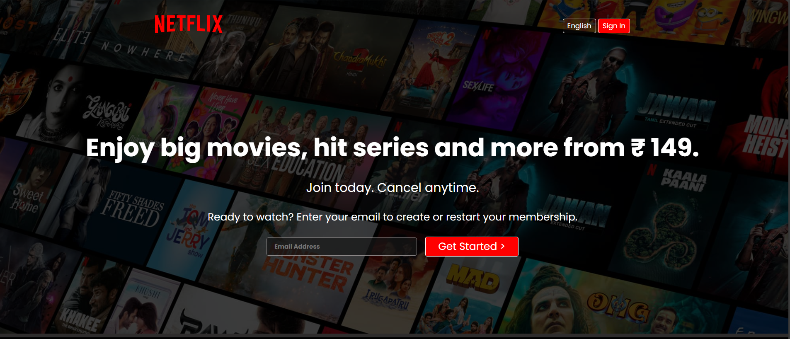

# 🎬 Netflix Clone

A simple front-end **Netflix homepage clone** built using only **HTML5** and **CSS3**. This project replicates the look and feel of Netflix’s landing page to practice layout, responsiveness, and UI design.

## 🌟 Features

- 🎥 Pixel-perfect clone of Netflix homepage
- 📱 Responsive design for mobile, tablet, and desktop
- ✨ Clean layout with Flexbox and Grid
- 📷 Hero banner with call-to-action
- 📧 Email sign-up form (non-functional demo)

## 🛠️ Tech Stack

- **HTML5**
- **CSS3**
- No JavaScript used in this version

## 📷 Screenshot

 <!-- Replace with your actual image file name -->

## 📁 Project Structure

